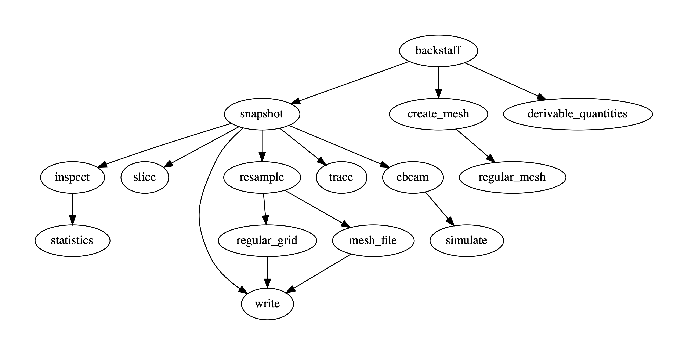
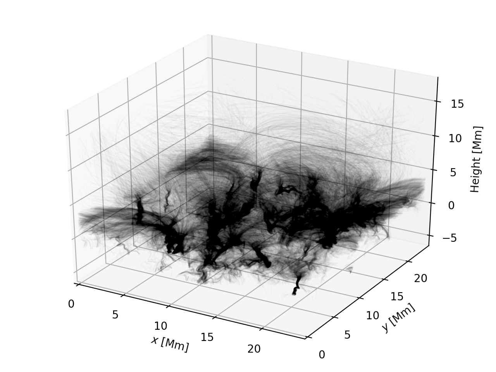
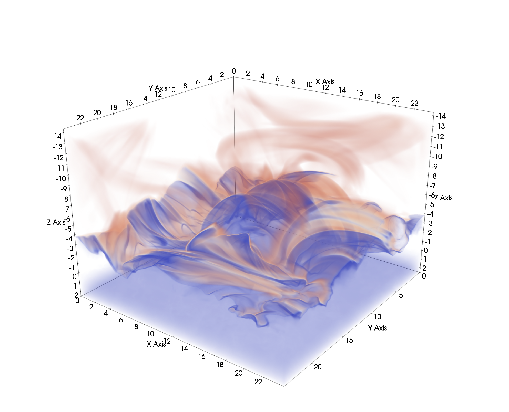

# Backstaff

A flexible tookit for working with Bifrost simulations, written in [Rust](https://www.rust-lang.org/).

## Purpose

The purpose of this project is to provide a fast, reliable and flexible framework for computations on Bifrost simulation data. The original motivation for the project was for me to have a way of experimenting with electron beam simulations. Using the Fortran module integrated in Bifrost would be too cumbersome, and a Python script would be far too slow. As I implemented necessary capabilities like reading and representing snapshots, interpolation and field line tracing, I began to see a lot of uses apart from electron beam simulations, and therefore adopted a modular structure where it would be easy to add new capabilities. Since the design is based on interfaces and generics it is also convenient to manage several different implementations of the same functionality. In the long term, I think such a unified framework would be the ideal place to implement common tasks like snapshot preparation and analysis or experiment with potential Bifrost features.

## Why Rust?

Rust is highly suited for this project, for a number of reasons. It is a low-level systems language with performance on par with C++. It has a strong focus on memory safety, with a unique ownership system that can guarantee the absence of undefined behaviour (i.e. no segfaults). This also makes it easy to parallelize in a reliable manner, as issues like data races can be detected at compile time. Despite the focus on performance it is easy to write modular and elegant code thanks to the presence of zero-cost abstractions and elements from functional programming. The included `cargo` package manager makes it strightforward to download dependencies, compile and run the code and generate documentation. These advantages, helped by the excellent free introductory book [The Rust Programming Language](https://doc.rust-lang.org/book/), mean that the language rapidly is gaining popularity.

## Features

The code consists of a core API as well as a set of optional features, some of which are included by default. You can specify additional features by adding the `--features` option to `cargo install` or `cargo build`, e.g. `cargo build --features=tracing,hdf5`. The `--no-default-features` flag can be used to disable the default features, and the `--all-features` flag can be used to include all features.

Currently the available features are:
* `cli`: A module exposing a command line interface (CLI) for applying the various tools in the library. This feature is included by default, but can be disabled if you only want to use the API.
* `statistics`: Support for printing snapshot statistics. This feature is included by default. Disabling it will remove the `snapshot-inspect-statistics` subcommand from the CLI.
* `netcdf`: Support for reading and writing snapshot data in the [NetCDF](https://www.unidata.ucar.edu/software/netcdf/) format (using the [CF conventions](http://cfconventions.org/)).
* `hdf5`: Support for the [HDF5](https://www.hdfgroup.org/solutions/hdf5/) format, in particular for writing field line data using the [H5Part](https://dav.lbl.gov/archive/Research/AcceleratorSAPP/) conventions.
* `json`: Support for serialization of certain output, like traced field lines, into JSON format.
* `pickle`: Support for serialization of certain output, like field slices or traced field lines, into Python's [`pickle`](https://docs.python.org/3/library/pickle.html) format.
* `tracing`: A module for tracing field lines. Including it will add the `snapshot-trace` subcommand to the CLI.
* `corks`: A module for tracing corks. Including it will add the `snapshot-corks` subcommand to the CLI.
* `ebeam`: A module for simulating electron beams. Including it will add the `snapshot-ebeam` subcommand to the CLI.
* `synthesis`: A module for synthesising optically thin spectral lines. Including it will add the `snapshot-synthesize` subcommand to the CLI.

## API documentation

The API documentation can be generated and viewed in your browser by running `cargo doc --open` in the project repository. If using non-default features you need to specify them with a `--features` option in order for them to be included in the documentation.

## Prerequisites

You need to have the Rust toolchain installed in order to build the binaries. Installation instructions can be found [here](https://www.rust-lang.org/tools/install).

If you want to work with [NetCDF](https://www.unidata.ucar.edu/software/netcdf/) files, the `netCDF-C` library must be available to link with. Installation instructions can be found [here](https://docs.unidata.ucar.edu/nug/current/getting_and_building_netcdf.html).

Similarly, support for the [HDF5](https://www.hdfgroup.org/solutions/hdf5/) format requires the `HDF5` library, which can be obtained [here](https://www.hdfgroup.org/downloads/hdf5/).

Spectral line synthesis through the `snapshot-synthesize` subcommand requires that the [CHIANTI database](https://www.chiantidatabase.org/) is available on the system, and that its location is specified in the `XUVTOP` environment variable. An additional requirement is a Python installation with the packages `numpy`, `scipy`, `numba` and [`ChiantiPy`](https://github.com/chianti-atomic/ChiantiPy) available.

## Installing the command line program

### Using `cargo install`

The Rust package manager `cargo` can be used to download, build and install the `backstaff` binary:
```
$ cargo install --git=https://github.com/lars-frogner/Backstaff.git
```
By default the binary will be placed in `$HOME/.cargo/bin`. A different directory can be specified with the option `--root=<DIR>`.

If installing with the `synthesis` feature, you will need to inform `cargo` about your Python library. This can be done with the following command, which prior to installation specifies the Python executable (in this case `python3`, but you may also give the full path to a specific executable) in the `PYO3_PYTHON` variable, and additionally adds a flag for linking with the corresponding Python library:
```
$ export PYO3_PYTHON=python3; \
    RUSTFLAGS="-C link-args=-Wl,-rpath,""$(dirname "$(dirname "$(which $PYO3_PYTHON)")")/lib""" \
    cargo install --git=https://github.com/lars-frogner/Backstaff.git --features=synthesis
```

**_NOTE:_** If the `cargo install` command complains about being unable to fetch the GitHub repository, try adding `CARGO_NET_GIT_FETCH_WITH_CLI=true` in front of `cargo install`.

### Compiling from source

You can compile the code in this repository using the `cargo build` command. Make sure to add the `--release` flag so that optimizations are turned on.

## Using the command line program

If you have installed the binary, simply run the `backstaff` command. If you instead are running directly from the repository, the simplest way to run the command line executable is with `cargo run` command. This will also perform any necessary compilation prior to running the program. All arguments following a double dash (`--`) will then be passed along to the `backstaff` program.

Actions are specified and configured through a hierachy of subcommands, which can be inspected by looking at their help texts. For example, the help text for the `snapshot` subcommand can be viewed as follows:
```
$ backstaff snapshot -h
```
```
backstaff-snapshot
Specify input snapshot to perform further actions on

USAGE:
    backstaff snapshot [OPTIONS] <INPUT_FILE> <SUBCOMMAND>

ARGS:
    <INPUT_FILE>    Path to the file representing the snapshot.
                    Assumes the following format based on the file extension:
                        *.idl: Parameter file with associated .snap [and .aux] file
                        *.nc: NetCDF file using the CF convention (requires the netcdf feature)

OPTIONS:
    -r, --snap-range=<FIRST>,<LAST>    Inclusive range of snapshot numbers associated with the input
                                       snapshot to process [default: only process INPUT_FILE]
    -e, --endianness=<ENDIANNESS>      Endianness to assume for snapshots in native binary format
                                        [default: little] [possible values: little, big, native]
    -v, --verbose                      Print status messages related to reading
    -h, --help                         Print help information

SUBCOMMANDS:
    derive        Compute derived quantities for the snapshot
    synthesize    Compute synthetic quantities for the snapshot
    inspect       Inspect properties of the snapshot
    slice         Extract a 2D slice of a quantity field in the snapshot
    extract       Extract a subdomain of the snapshot
    resample      Create a resampled version of the snapshot
    write         Write snapshot data to file
    corks         Trace corks in the velocity field of a set of snapshots
    trace         Trace field lines of a vector field in the snapshot
    ebeam         Perform actions related to electron beams in the snapshot
```

Here is a simplified overview of the command hierarchy available when all features are enabled.


This graph was created with the hidden `backstaff-command_graph` command, which outputs the command hierarchy graph in DOT format for rendering with [Graphviz](https://www.graphviz.org/).

## Examples

### Printing snapshot statistics

Printing some statistics for density and temperature in a snapshot could look like this:
```
$ backstaff snapshot photo_tr_001.idl inspect --included-quantities=r,tg statistics --slice-depths=-1
```
```
================================================================================
                  Statistics for r from snapshot 1 of photo_tr
--------------------------------------------------------------------------------
                         For all r, all x, all y, all z
================================================================================
Number of values:    452984832
Minimum value:       1.8624148e-8 at (  8.969,   6.625,  -5.802) [287, 212, 188]
Maximum value:       323.40679932 at ( 11.688,   4.500,   2.514) [374, 144, 767]
Average value:       13.853664398
5th percentile:      8.8137845e-8
30th percentile:     1.6243816e-7
50th percentile:     3.2699592e-7
70th percentile:     0.0031316155
95th percentile:     105.14699554
--------------------------------------------------------------------------------
                               In slice at z = -1
--------------------------------------------------------------------------------
Number of values:    589824
Minimum value:       3.3142376e-7 at ( 18.969,  14.500,  -1.000) [607, 464, 532]
Maximum value:       0.0221519507 at ( 17.719,  16.156,  -1.000) [567, 517, 532]
Average value:       0.0026214391
5th percentile:      3.2273060e-4
30th percentile:     0.0013502331
50th percentile:     0.0020803101
70th percentile:     0.0030976003
95th percentile:     0.0066802846
================================================================================
                 Statistics for tg from snapshot 1 of photo_tr
--------------------------------------------------------------------------------
                        For all tg, all x, all y, all z
================================================================================
Number of values:    452984832
Minimum value:       1998.7125244 at (  8.469,  19.344,  -1.240) [271, 619, 513]
Maximum value:       4.55296300e6 at ( 15.344,  14.969, -14.297) [491, 479,   0]
Average value:       9.67478562e5
5th percentile:      2988.0380859
30th percentile:     12443.400391
50th percentile:     45016.046875
70th percentile:     2.00756875e6
95th percentile:     2.36561025e6
--------------------------------------------------------------------------------
                               In slice at z = -1
--------------------------------------------------------------------------------
Number of values:    589824
Minimum value:       2003.6245117 at ( 14.156,   7.844,  -1.000) [453, 251, 532]
Maximum value:       1.52222038e6 at ( 18.938,  14.906,  -1.000) [606, 477, 532]
Average value:       5080.4008789
5th percentile:      2319.4228516
30th percentile:     2574.3144531
50th percentile:     2911.8168945
70th percentile:     3771.8098145
95th percentile:     5850.3222656
--------------------------------------------------------------------------------
```

### Resampling a snapshot

Here is an example of how an existing simulation snapshot can be resampled to a 1024<sup>3</sup> version of the original grid:
```
$ backstaff \
    snapshot -v photo_tr_001.idl \
    resample -v --sample-location=original \
        reshaped_grid --shape=1024,1024,1024 \
        weighted_sample_averaging \
    write -v --included-quantities=r,px,py,pz,e,bx,by,bz photo_tr_hires_001.idl
```
```
Reading parameters from photo_tr_001.idl
Reading grid from photo_tr.mesh
Detected horizontally regular grid
Writing parameters to photo_tr_hires_001.idl
Writing grid to photo_tr_hires.mesh
Reading r from photo_tr_001.snap
Resampling r
Writing r to photo_tr_hires_001.snap
...
Reading bz from photo_tr_001.snap
Resampling bz
Writing bz to photo_tr_hires_001.snap
```

Here the purpose was to produce a high-resolution version of the `photo_tr_001` snapshot to continue the simulation from, so only the primary variables were included (using the `--included-quantities` option), and the staggered locations of the variables were set to be preserved (`--sample-location=original`, which is the default and could be omitted). The generated files are `photo_tr_hires.mesh`, `photo_tr_hires_001.idl` and `photo_tr_hires_001.snap`.

**_NOTE:_** The default resampling method, `weighted_sample_averaging` (which, being the default, could have been omitted above), where the resampled value is computed in each new grid cell by averaging samples of the original field from each overlapped segment of the old grid, is highly robust and works well for any kind of resampling. However, it can be time consuming, so if you are in a hurry you can use `weighted_cell_averaging` (only suitable for downsampling) or `direct_sampling` (only suitable for upsampling).

### Tracing magnetic field lines

The following command traces a set of magnetic field lines from 100x100 regularly spaced locations in the upper chromosphere, and extract the mass density and temperature along the field lines:
```
$ backstaff --timing \
    snapshot photo_tr_001.idl \
    trace -v --extracted-quantities=r,tg field_lines.h5part \
        basic_tracer --max-length=100.0 \
        slice_seeder --axis=z --coord=-2.0 \
            regular --shape=100,100
```
```
Found 10000 start positions
Successfully traced 10000 field lines
Extracting r along field line paths
Extracting tg along field line paths
Saving field lines in field_lines.h5part
Elapsed time: 18.861097286 s
```

Here the field line data was saved in a H5Part file, which enables easy visualization with tools like [ParaView](https://www.paraview.org/) and [VisIt](https://wci.llnl.gov/simulation/computer-codes/visit/).

Here is a ParaView visualization of the density along the field lines:


**_NOTE:_** The program has to be built with the `tracing` feature in order for the `trace` command to become available, and the `hdf5` feature in order for the `.h5part` format to be supported.

### Creating NetCDF files for visualization

By enabling the `netcdf` feature, it is easy to convert snapshot data into the NetCDF format, which is supported by a wide range of visualization tools, including [ParaView](https://www.paraview.org/) and [VAPOR](https://www.vapor.ucar.edu/). In the following example, the temperature and mass density fields in a set of Bifrost snapshots are resampled to a regular 512<sup>3</sup> grid and written to a set of NetCDF files.
```
$ backstaff \
    snapshot -v photo_tr_001.idl --snap-range=1,3 \
    resample -v --sample-location=center regular_grid --shape=512,512,512 \
    write -v --strip --included-quantities=r,tg photo_tr.nc
```
```
Reading parameters from photo_tr_001.idl
Reading grid from photo_tr.mesh
Detected horizontally regular grid
Writing grid to photo_tr_001.nc
Reading r from photo_tr_001.snap
Resampling r
Writing r to photo_tr_001.nc
Reading tg from photo_tr_001.aux
Resampling tg
Writing tg to photo_tr_001.nc
...
Reading parameters from photo_tr_003.idl
Reading grid from photo_tr.mesh
Detected horizontally regular grid
Writing grid to photo_tr_003.nc
Reading r from photo_tr_003.snap
Resampling r
Writing r to photo_tr_003.nc
Reading tg from photo_tr_003.aux
Resampling tg
Writing tg to photo_tr_003.nc
```

Here is a ParaView volume rendering of the resulting temperature field from one of the `.nc` files:


## Enabling tab-completion for `backstaff` arguments

The [clap](https://clap.rs/) argument parser powering the `backstaff` CLI can generate tab-completion files compatible with various shells. This can be done for `backstaff` using the hidden `backstaff-completions` command. To generate files for your shell, start by running
```
$ backstaff completions -h
```
and follow the instructions.
