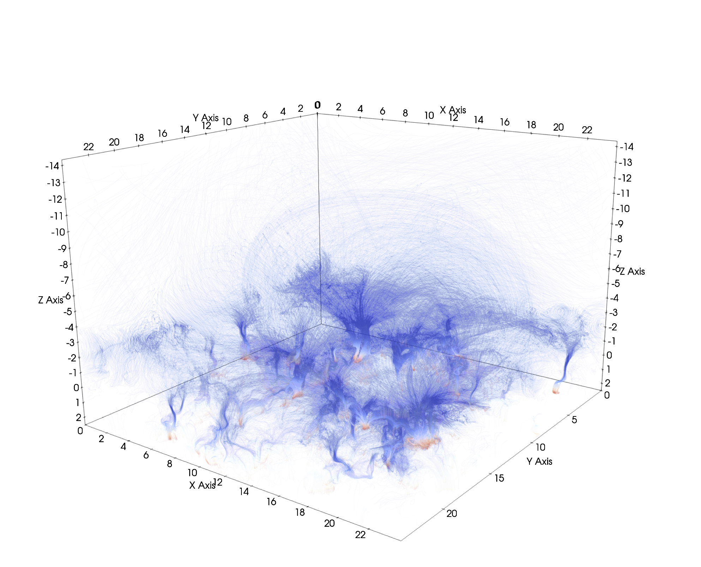

# bifrost-rust

A flexible tookit for working with Bifrost simulations, written in [Rust](https://www.rust-lang.org/).

## Purpose

The purpose of this project is to provide a fast, reliable and flexible framework for computations on Bifrost simulation data. The original motivation for the project was for me to have a way of experimenting with electron beam simulations. Using the Fortran module integrated in Bifrost would be too cumbersome, and a Python script would be far too slow. As I implemented necessary capabilities like reading and representing snapshots, interpolation and field line tracing, I began to see a lot of uses apart from electron beam simulations, and therefore adopted a modular structure where it would be easy to add new capabilities. Since the design is based on interfaces and generics it is also convenient to manage several different implementations of the same functionality. In the long term, I think such a unified framework would be the ideal place to implement common tasks like snapshot preparation and analysis or experiment with potential Bifrost features.

## Why Rust?

Rust is highly suited for this project, for a number of reasons. It is a low-level systems language with performance on par with C++. It has a strong focus on memory safety, with a unique ownership system that can guarantee the absence of undefined behaviour (i.e. no segfaults). This also makes it easy to parallelize in a reliable manner, as issues like data races can be detected at compile time. Despite the focus on performance it is easy to write modular and elegant code thanks to the presence of zero-cost abstractions and elements from functional programming. The included `cargo` package manager makes it strightforward to download dependencies, compile and run the code and generate documentation. These advantages, helped by the excellent free introductory book [The Rust Programming Language](https://doc.rust-lang.org/book/), mean that the language rapidly is gaining popularity.

## Prerequesites

You need to have the Rust toolchain installed in order to build the binaries. Installation instructions can be found at https://www.rust-lang.org/tools/install.

## Installation

Simply clone this repository.

## Compilation

You can compile the code using the `cargo build` command. Make sure to add the `--release` flag so that optimizations are turned on. The code consists of a core API as well as a set of optional features, some of which are included by default. You can specify additional features to include with the `--features` flag. The `--no-default-features` flag can be used to disable the default features.

## Features

Currently the available features are:
* `cli`: A module exposing a command line interface (CLI) for applying the various tools in the library. This feature is included by default.
* `tracing`: A module for tracing field lines. Including it will add the `snapshot-trace` subcommand to the CLI.
* `ebeam`: A module for simulating electron beams. Including it will add the `snapshot-ebeam` subcommand to the CLI. Requires `tracing`.

## Documentation

The API documentation can be generated and viewed in your browser by running `cargo doc --open` in the project repository. If using non-default features you need to specify them with a `--features` flag in order for them to be included in the documentation.

## Using the command line program

The simplest way to run the command line executable is with `cargo run` command. This will also perform any necessary compilation prior to running the program. All arguments following a double dash (`--`) will be passed along to the command line program.

Actions are specified and configured through a hierachy of subcommands, which can be inspected by looking at their help texts. For example, the help text for the `snapshot` subcommand can be viewed as follows:
```
$ cargo run --release -- snapshot -h
bifrost-snapshot
Specify input snapshot to perform further actions on

USAGE:
    bifrost snapshot [FLAGS] [OPTIONS] --param-path=<PATH> <SUBCOMMAND>

FLAGS:
    -v, --verbose    Print status messages while reading fields
    -h, --help       Print help information

OPTIONS:
    -p, --param-path=<PATH>          Path to the parameter (.idl) file for the snapshot
    -g, --grid-type=<TYPE>           Type of grid to assume for the snapshot
                                      [default: horizontally-regular]  [possible values: horizontally-regular, regular]
    -e, --endianness=<ENDIANNESS>    Endianness to assume for the snapshot
                                      [default: little]  [possible values: little, big]

SUBCOMMANDS:
    inspect     Inspect properties of the snapshot
    slice       Extract a 2D slice of a quantity field in the snapshot
    resample    Creates a resampled version of the snapshot
```

Printing some statistics for density and temperature in a snapshot could look like this:
```
$ cargo run --release -- \
    snapshot --param-path=en024031_emer3.0str_ebeam_351.idl \
    inspect \
    statistics --quantities=r,tg
*************** Statistics for r ***************
Number of values: 452984832
Number of NaNs:   0
Minimum value:    0.000000009510704 at [542, 704, 104] = (16.9375, 22, -8.260805)
Maximum value:    302.91656 at [174, 64, 767] = (5.4375, 2, 2.513908)
Average value:    13.05826
*************** Statistics for tg ***************
Number of values: 452984832
Number of NaNs:   0
Minimum value:    1998.5657 at [576, 219, 443] = (18, 6.84375, -2.108491)
Maximum value:    4060329 at [81, 746, 0] = (2.53125, 23.3125, -14.29715)
Average value:    576887.3
```

Here is a more complicated example where we trace a set of magnetic field lines from 100x100 regularly spaced locations in the upper chromosphere:
```
$ cargo run --release --features tracing -- \
    --timing \
    snapshot --param-path=en024031_emer3.0str_ebeam_351.idl \
    trace --verbose --output-path=field_lines.fl \
    basic_tracer --max-length=100.0 \
    slice_seeder --axis=z --coord=-2.0 \
    regular --shape=100,100
Found 10000 start positions
Successfully traced 10000 field lines
Saving field lines in field_lines.fl
Elapsed time: 14.990034051 s
```

Using the included `bifrost_utils` Python package we can easily read and visualize the field line data:
```python
import bifrost_utils.field_lines as field_lines
field_line_set = field_lines.FieldLineSet3.from_file('field_lines.fl')
field_lines.plot_field_lines(field_line_set, alpha=0.01, output_path='field_lines.png')
```

This is the resulting figure:

